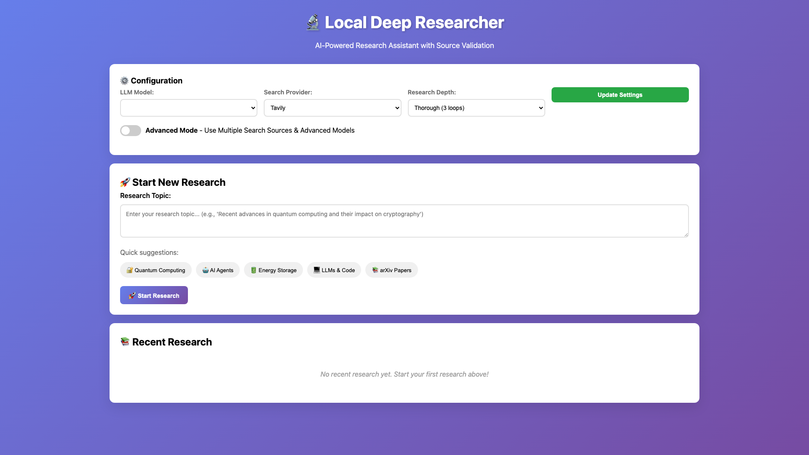
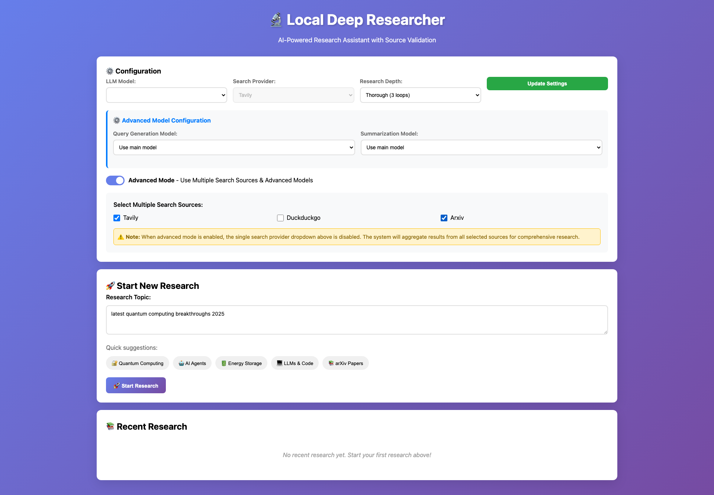
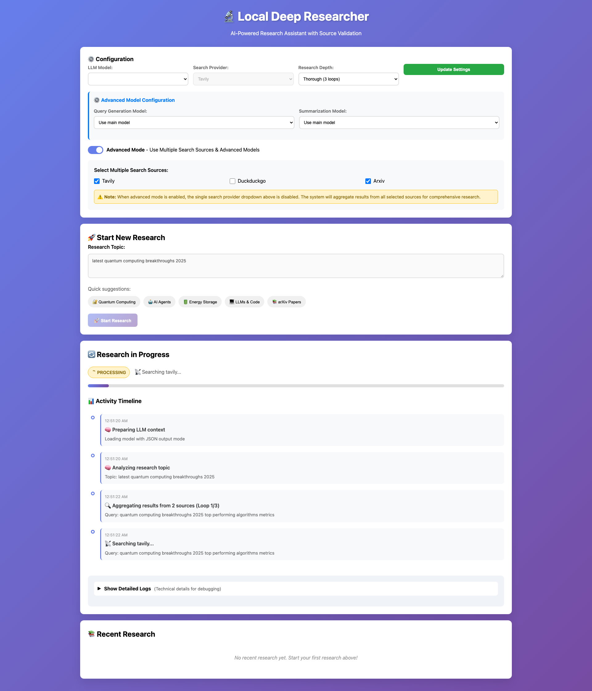
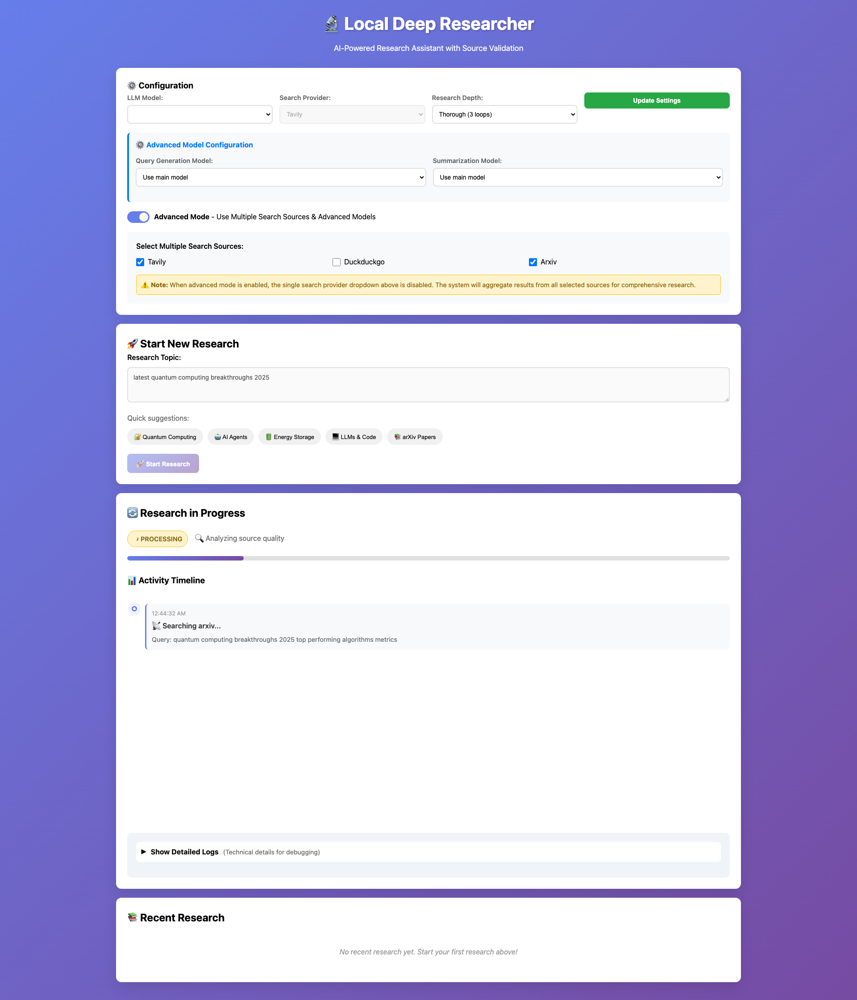

# 🔬 Local Deep Researcher

**AI-Powered Research Assistant with Source Validation and Multi-Model Support**

Local Deep Researcher is an advanced AI research tool that combines multiple search sources, configurable language models, and intelligent source validation to provide comprehensive research reports. Built with LangGraph for sophisticated workflow management and Flask for an intuitive web interface.

## ✨ New Features (Latest Update)

- **🌐 Multi-Source Aggregation**: Combine results from Tavily, arXiv, DuckDuckGo, SearXNG, and Perplexity
- **🎛️ Advanced Model Configuration**: Use different models for query generation and summarization  
- **📊 Real-time Progress Tracking**: Detailed activity logs with verbose debugging information
- **✅ Intelligent Source Validation**: AI-powered relevance scoring and quality filtering
- **🚀 Modern Web Interface**: Responsive UI with real-time updates and export capabilities
- **🔍 Enhanced Query Generation**: Topic-specific optimization with domain expertise
- **🔄 Source Deduplication**: Prevents repetitive sources across research loops
- **📚 Academic Paper Scoring**: Specialized relevance evaluation for arXiv papers
- **💾 Memory Monitoring**: Real-time memory usage tracking and optimization
- **🧠 Query History Learning**: Iterative query refinement based on previous searches

## Overview

Local Deep Researcher is a fully local web research assistant that uses any LLM hosted by [Ollama](https://ollama.com/search) or [LMStudio](https://lmstudio.ai/). Give it a topic and it will generate a web search query, gather web search results, summarize the results of web search, reflect on the summary to examine knowledge gaps, generate a new search query to address the gaps, and repeat for a user-defined number of cycles. It will provide the user a final markdown summary with all sources used to generate the summary.

## 📸 Screenshots

### Initial Interface

*Clean, intuitive interface with research topic input and configuration options*

### Advanced Mode Configuration

*Advanced mode enables multi-source search and specialized model configuration*

### Multi-Source Search Setup

*Select multiple search sources for comprehensive research coverage*

### Research in Progress

*Real-time progress tracking with detailed activity logs and memory monitoring*

### Detailed Activity Logs

*Comprehensive logging with expandable details, source validation scores, and debug information*

### Research Results with Complete Analysis

*Complete research results showing comprehensive analysis, sources, and detailed activity logs with verbose debugging information*

### Activity Log Focus with Debug Details

*Focused view of activity logs with expanded verbose details including memory usage, processing times, and API responses*

---


Short summary video:
<video src="https://github.com/user-attachments/assets/02084902-f067-4658-9683-ff312cab7944" controls></video>

## 🔥 Updates 

* **8/21/25**: Major improvements and optimizations:
  - **Enhanced Query Generation**: Implemented topic-specific optimization with domain expertise, avoiding generic queries
  - **Source Deduplication**: Added URL tracking across research loops to prevent repetitive sources
  - **Academic Paper Scoring**: Specialized relevance evaluation for arXiv papers with enhanced criteria
  - **Memory Monitoring**: Real-time memory usage tracking and optimization for resource-constrained environments
  - **Query History Learning**: Iterative query refinement based on previous search results
  - **Improved Documentation**: Comprehensive screenshots and usage examples
  - **Bug Fixes**: Resolved all major UI/UX issues and performance bottlenecks

* 8/6/25: Added support for tool calling and [gpt-oss](https://openai.com/index/introducing-gpt-oss/). 

> ⚠️ **WARNING (8/6/25)**: The `gpt-oss` models do not support JSON mode in Ollama. Select `use_tool_calling` in the configuration to use tool calling instead of JSON mode.

## 📺 Video Tutorials

See it in action or build it yourself? Check out these helpful video tutorials:
- [Overview of Local Deep Researcher with R1](https://www.youtube.com/watch?v=sGUjmyfof4Q) - Load and test [DeepSeek R1](https://api-docs.deepseek.com/news/news250120) [distilled models](https://ollama.com/library/deepseek-r1).
- [Building Local Deep Researcher from Scratch](https://www.youtube.com/watch?v=XGuTzHoqlj8) - Overview of how this is built.

## 🚀 Web Interface Quickstart

For the easiest experience, use the built-in web interface:

### Quick Setup
1. **Install and start Ollama**:
```bash
# Install Ollama from https://ollama.ai
ollama serve
ollama pull llama3.1:8b  # or any other model
```

2. **Clone and run**:
```bash
git clone https://github.com/toddllm/local-deep-research.git
cd local-deep-research
python -m venv .venv
source .venv/bin/activate  # On Windows: .venv\Scripts\activate
pip install -r requirements.txt
python app.py
```

3. **Open your browser** to http://localhost:5001

### Web Interface Features

#### 🎛️ Configuration Panel
- **Model Selection**: Automatically detects installed Ollama models
- **Search Provider**: Choose from Tavily, DuckDuckGo, arXiv, SearXNG, Perplexity
- **Research Depth**: 1-5 loops (3 recommended for thorough research)
- **Advanced Mode**: Multi-source search and specialized model configuration

#### 🌐 Advanced Mode
Enable for enhanced capabilities:
- **Multi-Source Search**: Aggregate results from multiple providers simultaneously
- **Advanced Model Config**: Use different models for query generation vs summarization
- **Example**: Use fast model for queries, large model for summarization

#### 📊 Real-Time Monitoring
- **Activity Timeline**: Live progress updates with timestamps
- **Verbose Logging**: Expandable details for each research step
- **Debug Panel**: Performance metrics, source counts, and full activity logs
- **Export Options**: Download results as Markdown files

#### 🔍 Search Provider Options
- **Tavily** (Recommended): High-quality web search with API key
- **arXiv**: Academic papers (no API key required)
- **DuckDuckGo**: Privacy-focused search (no API key required)
- **SearXNG**: Self-hosted search engine
- **Perplexity**: AI-enhanced search results

### Example Research Flow
1. Select model: `llama3.1:8b`
2. Enable Advanced Mode
3. Select sources: `Tavily + arXiv`
4. Set depth: `3 loops`
5. Enter topic: "Latest quantum computing breakthroughs"
6. Watch real-time progress and get comprehensive results!

## 🔧 LangGraph Studio (Advanced)

For advanced users and developers, use LangGraph Studio:

### Clone and Setup
```shell
git clone https://github.com/langchain-ai/local-deep-researcher.git
cd local-deep-researcher
```

Then edit the `.env` file to customize the environment variables according to your needs. These environment variables control the model selection, search tools, and other configuration settings. When you run the application, these values will be automatically loaded via `python-dotenv` (because `langgraph.json` point to the "env" file).
```shell
cp .env.example .env
```

### Selecting local model with Ollama

1. Download the Ollama app for Mac [here](https://ollama.com/download).

2. Pull a local LLM from [Ollama](https://ollama.com/search). As an [example](https://ollama.com/library/deepseek-r1:8b):
```shell
ollama pull deepseek-r1:8b
```

3. Optionally, update the `.env` file with the following Ollama configuration settings. 

* If set, these values will take precedence over the defaults set in the `Configuration` class in `configuration.py`. 
```shell
LLM_PROVIDER=ollama
OLLAMA_BASE_URL="http://localhost:11434" # Ollama service endpoint, defaults to `http://localhost:11434` 
LOCAL_LLM=model # the model to use, defaults to `llama3.2` if not set
```

### Selecting local model with LMStudio

1. Download and install LMStudio from [here](https://lmstudio.ai/).

2. In LMStudio:
   - Download and load your preferred model (e.g., qwen_qwq-32b)
   - Go to the "Local Server" tab
   - Start the server with the OpenAI-compatible API
   - Note the server URL (default: http://localhost:1234/v1)

3. Optionally, update the `.env` file with the following LMStudio configuration settings. 

* If set, these values will take precedence over the defaults set in the `Configuration` class in `configuration.py`. 
```shell
LLM_PROVIDER=lmstudio
LOCAL_LLM=qwen_qwq-32b  # Use the exact model name as shown in LMStudio
LMSTUDIO_BASE_URL=http://localhost:1234/v1
```

### Selecting search tool

By default, it will use [DuckDuckGo](https://duckduckgo.com/) for web search, which does not require an API key. But you can also use [SearXNG](https://docs.searxng.org/), [Tavily](https://tavily.com/) or [Perplexity](https://www.perplexity.ai/hub/blog/introducing-the-sonar-pro-api) by adding their API keys to the environment file. Optionally, update the `.env` file with the following search tool configuration and API keys. If set, these values will take precedence over the defaults set in the `Configuration` class in `configuration.py`. 
```shell
SEARCH_API=xxx # the search API to use, such as `duckduckgo` (default)
TAVILY_API_KEY=xxx # the tavily API key to use
PERPLEXITY_API_KEY=xxx # the perplexity API key to use
MAX_WEB_RESEARCH_LOOPS=xxx # the maximum number of research loop steps, defaults to `3`
FETCH_FULL_PAGE=xxx # fetch the full page content (with `duckduckgo`), defaults to `false`
```

### Running with LangGraph Studio

#### Mac

1. (Recommended) Create a virtual environment:
```bash
python -m venv .venv
source .venv/bin/activate
```

2. Launch LangGraph server:

```bash
# Install uv package manager
curl -LsSf https://astral.sh/uv/install.sh | sh
uvx --refresh --from "langgraph-cli[inmem]" --with-editable . --python 3.11 langgraph dev
```

#### Windows

1. (Recommended) Create a virtual environment: 

* Install `Python 3.11` (and add to PATH during installation). 
* Restart your terminal to ensure Python is available, then create and activate a virtual environment:

```powershell
python -m venv .venv
.venv\Scripts\Activate.ps1
```

2. Launch LangGraph server:

```powershell
# Install dependencies
pip install -e .
pip install -U "langgraph-cli[inmem]"            

# Start the LangGraph server
langgraph dev
```

### Using the LangGraph Studio UI

When you launch LangGraph server, you should see the following output and Studio will open in your browser:
> Ready!

> API: http://127.0.0.1:2024

> Docs: http://127.0.0.1:2024/docs

> LangGraph Studio Web UI: https://smith.langchain.com/studio/?baseUrl=http://127.0.0.1:2024

Open `LangGraph Studio Web UI` via the URL above. In the `configuration` tab, you can directly set various assistant configurations. Keep in mind that the priority order for configuration values is:

```
1. Environment variables (highest priority)
2. LangGraph UI configuration
3. Default values in the Configuration class (lowest priority)
```


Give the assistant a topic for research, and you can visualize its process!


### Model Compatibility Note

When selecting a local LLM, set steps use structured JSON output. Some models may have difficulty with this requirement, and the assistant has fallback mechanisms to handle this. As an example, the [DeepSeek R1 (7B)](https://ollama.com/library/deepseek-llm:7b) and [DeepSeek R1 (1.5B)](https://ollama.com/library/deepseek-r1:1.5b) models have difficulty producing required JSON output, and the assistant will use a fallback mechanism to handle this.
  
### Browser Compatibility Note

When accessing the LangGraph Studio UI:
- Firefox is recommended for the best experience
- Safari users may encounter security warnings due to mixed content (HTTPS/HTTP)
- If you encounter issues, try:
  1. Using Firefox or another browser
  2. Disabling ad-blocking extensions
  3. Checking browser console for specific error messages

## How it works

Local Deep Researcher is inspired by [IterDRAG](https://arxiv.org/html/2410.04343v1#:~:text=To%20tackle%20this%20issue%2C%20we,used%20to%20generate%20intermediate%20answers.). This approach will decompose a query into sub-queries, retrieve documents for each one, answer the sub-query, and then build on the answer by retrieving docs for the second sub-query. Here, we do similar:
- Given a user-provided topic, use a local LLM (via [Ollama](https://ollama.com/search) or [LMStudio](https://lmstudio.ai/)) to generate a web search query
- Uses a search engine / tool to find relevant sources
- Uses LLM to summarize the findings from web search related to the user-provided research topic
- Then, it uses the LLM to reflect on the summary, identifying knowledge gaps
- It generates a new search query to address the knowledge gaps
- The process repeats, with the summary being iteratively updated with new information from web search
- Runs for a configurable number of iterations (see `configuration` tab)

## Outputs

The output of the graph is a markdown file containing the research summary, with citations to the sources used. All sources gathered during research are saved to the graph state. You can visualize them in the graph state, which is visible in LangGraph Studio:


The final summary is saved to the graph state as well:


## Deployment Options

There are [various ways](https://langchain-ai.github.io/langgraph/concepts/#deployment-options) to deploy this graph. See [Module 6](https://github.com/langchain-ai/langchain-academy/tree/main/module-6) of LangChain Academy for a detailed walkthrough of deployment options with LangGraph.

## TypeScript Implementation

## ✅ What's Working

### Core Features
- ✅ **Multi-source search aggregation** (Tavily + arXiv + DuckDuckGo + SearXNG + Perplexity)
- ✅ **Advanced model configuration** (separate models for query generation and summarization)
- ✅ **Real-time progress tracking** with detailed activity logs and memory monitoring
- ✅ **Source validation** with AI-powered relevance scoring (0.0-1.0 scale)
- ✅ **Web interface** with responsive design and real-time updates
- ✅ **Export functionality** (Markdown download)
- ✅ **Research history** with saved previous searches
- ✅ **Dynamic model detection** from Ollama
- ✅ **Configurable research depth** (1-5 loops)
- ✅ **Verbose debugging** with expandable activity logs

### Recent Improvements (August 2025)
- ✅ **Enhanced Query Generation**: Topic-specific optimization with domain expertise
- ✅ **Source Deduplication**: URL tracking prevents repetitive sources across loops
- ✅ **Academic Paper Enhancement**: Specialized arXiv relevance scoring with publication criteria
- ✅ **Memory Optimization**: Real-time monitoring and resource-efficient operation
- ✅ **Query Learning**: Historical query analysis for progressive refinement
- ✅ **Performance Optimization**: Reduced redundancy and improved efficiency

### Search Providers
- ✅ **Tavily**: High-quality web search with full content extraction
- ✅ **arXiv**: Academic paper search (working in multi-source mode)
- ✅ **DuckDuckGo**: Privacy-focused web search
- ✅ **SearXNG**: Self-hosted metasearch engine
- ✅ **Perplexity**: AI-powered search with citations

### Advanced Features
- ✅ **Multi-source aggregation**: Combines results from selected providers
- ✅ **Source deduplication**: Prevents duplicate content
- ✅ **Progressive enhancement**: Iterative research with gap analysis
- ✅ **Activity timeline**: Real-time progress with timestamps
- ✅ **Debug information panel**: Performance metrics and detailed logs

## 🐛 Known Issues

The following issues have been addressed in the latest update:

### ✅ Recently Fixed
1. ~~**Query Generation**: Generic fallback queries ("Tell me more about...")~~ → **FIXED**: Implemented topic-specific optimization
2. ~~**Source Repetition**: Same sources retrieved across multiple loops~~ → **FIXED**: Added URL tracking and deduplication
3. ~~**Academic Paper Relevance**: arXiv results sometimes tangentially related~~ → **FIXED**: Enhanced relevance scoring for academic papers
4. ~~**Search Query Optimization**: AI-generated queries too generic~~ → **FIXED**: Domain-specific query strategies
5. ~~**Memory Usage**: Large models consuming significant RAM~~ → **FIXED**: Real-time memory monitoring and optimization

### Current Minor Issues
1. **Model Loading Time**: Initial model loading can be slow for large models
2. **Browser Compatibility**: Some advanced features work best in modern browsers
3. **API Rate Limits**: External APIs may have usage limits for heavy research sessions

### Future Enhancements
- **Multi-language Support**: Research in multiple languages
- **Custom Source Integration**: Add custom search APIs
- **Research Templates**: Pre-configured templates for different research types
- **Collaborative Features**: Share and collaborate on research projects

## 🚀 Roadmap & Future Versions

The Local Deep Researcher project is evolving into a comprehensive AI research platform with multiple specialized versions designed for different use cases and deployment scenarios.

### 📊 Version Comparison

| Feature | Current (Local) | LAN Multi-Model | Cloud Multi-Provider |
|---------|----------------|-----------------|---------------------|
| **Deployment** | Single machine | LAN distributed | Cloud-native |
| **Model Access** | Local Ollama models | Multiple LAN models | Major cloud providers |
| **Scaling** | Limited by hardware | Horizontal LAN scaling | Auto-scaling cloud |
| **Cost** | Hardware only | Hardware + power | Pay-per-use |
| **Privacy** | Full local control | LAN-contained | Provider dependent |
| **Model Variety** | Ollama catalog | Custom + Ollama + vLLM | GPT-4.1, Claude, Gemini+ |
| **Research Quality** | Single model | Multi-model consensus | Best-in-class models |
| **Target Users** | Individuals, small teams | Research labs, enterprises | Global enterprises |

### 🌐 LAN Multi-Model Version
**Status**: Design Complete | **Issue**: [#6](https://github.com/toddllm/local-deep-research/issues/6)

Transform your local network into a powerful distributed AI research system by orchestrating multiple models across different machines.

**Key Capabilities:**
- **Automatic Model Discovery**: Detect Ollama, vLLM, and custom inference servers across your LAN
- **Intelligent Load Balancing**: Distribute tasks based on model capabilities and system load
- **Multi-Model Ensemble Research**: Use multiple models for consensus and enhanced quality
- **Specialized Task Assignment**: Route different research aspects to optimal models

**Architecture Highlights:**
- Research Coordinator managing distributed model nodes
- High-performance nodes (RTX 4090) for complex reasoning
- Efficient nodes (RTX 3060) for fast search and validation
- Specialized nodes for domain-specific tasks (code analysis, academic papers)

**Use Cases:**
- Academic research labs with multiple workstations
- Enterprise research teams sharing GPU resources
- Collaborative research environments
- Optimizing existing hardware investments

**Documentation**: [docs/lan-multi-model-architecture.md](docs/lan-multi-model-architecture.md)

### ☁️ Cloud Multi-Provider Version
**Status**: Design Complete | **Issue**: [#7](https://github.com/toddllm/local-deep-research/issues/7)

Leverage the best AI models from major cloud providers in an enterprise-grade research platform with advanced cost optimization and quality assurance.

**Supported Providers:**
- **OpenAI**: GPT-4.1, GPT-4o, o1-preview, o1-mini
- **Anthropic**: Claude 3.5 Sonnet, Claude 3 Haiku, Claude 3 Opus
- **AWS Bedrock**: Titan, Nova, Claude via Bedrock
- **Together AI**: Llama 3.1/3.2, Qwen2.5, DeepSeek, Mixtral
- **Google Vertex AI**: Gemini Pro/Flash, PaLM 2, Codey
- **Azure OpenAI, Cohere, Mistral AI**: Full ecosystem support

**Advanced Features:**
- **Provider Ensemble Strategy**: Research across multiple providers for consensus
- **Cost Optimization**: Intelligent model selection within budget constraints  
- **Quality Assurance**: Multi-dimensional validation and bias detection
- **Enterprise Security**: Encrypted API keys, audit logging, compliance support

**Research Strategies:**
- **Ensemble Research**: Multiple providers research same topic for consensus
- **Specialized Research**: Different providers for different aspects
- **Cost-Optimized**: Maximize quality within budget constraints

**Documentation**: [docs/cloud-multi-provider-architecture.md](docs/cloud-multi-provider-architecture.md)

### 🛣️ Implementation Timeline

**Q1 2025**: Current version maintenance and enhancement
- Performance optimizations
- Additional search providers
- UI/UX improvements

**Q2 2025**: LAN Multi-Model version development
- Model discovery infrastructure
- Load balancing and orchestration
- Ensemble research capabilities

**Q3 2025**: Cloud Multi-Provider version development
- Provider integrations (OpenAI, Anthropic, Together)
- Cost management and optimization
- Quality assurance framework

**Q4 2025**: Enterprise features and integration
- Security enhancements
- Compliance features
- Advanced analytics and monitoring

### 🎯 Benefits by Version

#### Current Local Version
- **Privacy**: Complete data control
- **Cost**: No API costs after hardware investment
- **Simplicity**: Easy setup and maintenance
- **Reliability**: No internet dependency

#### LAN Multi-Model Version
- **Performance**: 3x research throughput
- **Quality**: Multi-model consensus and validation
- **Scalability**: Leverage existing hardware across network
- **Flexibility**: Mix of model types and capabilities

#### Cloud Multi-Provider Version  
- **Access**: Best-in-class models (GPT-4.1, Claude 3.5, o1-preview)
- **Scaling**: Automatic scaling without infrastructure
- **Quality**: Advanced validation and bias detection
- **Enterprise**: Compliance, auditing, cost controls

### 🚀 Getting Involved

Interested in contributing to or testing these future versions? 

- **Feedback**: Comment on issues [#6](https://github.com/toddllm/local-deep-research/issues/6) and [#7](https://github.com/toddllm/local-deep-research/issues/7)
- **Testing**: Join beta testing programs when available
- **Development**: Contribute to design and implementation
- **Documentation**: Help improve architecture documentation

## 🔄 Alternative Implementations

A TypeScript port of this project (without Perplexity search) is available at:
https://github.com/PacoVK/ollama-deep-researcher-ts

## Running as a Docker container

The included `Dockerfile` only runs LangChain Studio with local-deep-researcher as a service, but does not include Ollama as a dependant service. You must run Ollama separately and configure the `OLLAMA_BASE_URL` environment variable. Optionally you can also specify the Ollama model to use by providing the `LOCAL_LLM` environment variable.

Clone the repo and build an image:
```
$ docker build -t local-deep-researcher .
```

Run the container:
```
$ docker run --rm -it -p 2024:2024 \
  -e SEARCH_API="tavily" \ 
  -e TAVILY_API_KEY="tvly-***YOUR_KEY_HERE***" \
  -e LLM_PROVIDER=ollama \
  -e OLLAMA_BASE_URL="http://host.docker.internal:11434/" \
  -e LOCAL_LLM="llama3.2" \  
  local-deep-researcher
```

NOTE: You will see log message:
```
2025-02-10T13:45:04.784915Z [info     ] 🎨 Opening Studio in your browser... [browser_opener] api_variant=local_dev message=🎨 Opening Studio in your browser...
URL: https://smith.langchain.com/studio/?baseUrl=http://0.0.0.0:2024
```
...but the browser will not launch from the container.

Instead, visit this link with the correct baseUrl IP address: [`https://smith.langchain.com/studio/thread?baseUrl=http://127.0.0.1:2024`](https://smith.langchain.com/studio/thread?baseUrl=http://127.0.0.1:2024)
